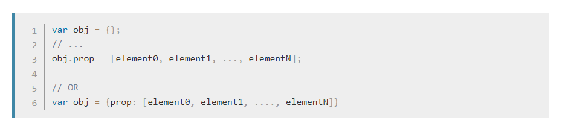

# Prism Style

### Available themes

* [__CB__](CB/prism-cb.min.css) (originally by [C. Bavota](https://bitbucket.org/cbavota), adapted by [atelierbram](https://github.com/atelierbram)) 

* [__GHColors__](Ghcolors/prism-ghcolors.min.css) (by [aviaryan](https://github.com/aviaryan)) 

* [__Pojoaque__](Pojoaque/prism-pojoaque.min.css) (originally by [Jason Tate](http://web-cms-designs.com/ftopict-10-pojoaque-style-for-highlight-js-code-highlighter.html), adapted by [atelierbram](https://github.com/atelierbram)) 

* [__Xonokai__](Xonokai/prism-xonokai.min.css) (originally by [Maxime Thirouin (MoOx)](https://github.com/MoOx), adapted by [atelierbram](https://github.com/atelierbram)) 

* [__Ateliersulphurpool-light__](Base16AteliersulphurpoolLight/prism-base16-ateliersulphurpool.light.min.css) (by [Bram de Haan](https://github.com/atelierbram)) 

* [__Hopscotch__](Hopscotch/prism-hopscotch.min.css) (by [Jan T. Sott](https://github.com/idleberg)) 

* [__Atom Dark__](AtomDark/prism-atom-dark.min.css) (by [gibsjose](https://github.com/gibsjose), based on [Atom Dark Syntax theme](https://github.com/atom/atom-dark-syntax)) 

* [__Duotone Dark__](DuotoneDark/prism-duotone-dark.min.css) (by [Simurai](https://github.com/simurai), based on [Duotone Dark Syntax theme for Atom](https://github.com/simurai/duotone-dark-syntax)) 

* [__Duotone Sea__](DuotoneSea/prism-duotone-sea.min.css) (by [Simurai](https://github.com/simurai), based on [DuoTone Dark Sea Syntax theme for Atom](https://github.com/simurai/duotone-dark-sea-syntax)) 

* [__Duotone Space__](DuotoneSpace/prism-duotone-space.min.css) (by [Simurai](https://github.com/simurai), based on [DuoTone Dark Space Syntax theme for Atom](https://github.com/simurai/duotone-dark-space-syntax)) 

* [__Duotone Earth__](DuotoneEarth/prism-duotone-earth.min.css) (by [Simurai](https://github.com/simurai), based on [DuoTone Dark Earth Syntax theme for Atom](https://github.com/simurai/duotone-dark-earth-syntax)) 

* [__Duotone Forest__](DuotoneForest/prism-duotone-forest.min.css) (by [Simurai](https://github.com/simurai), based on [DuoTone Dark Forest Syntax theme for Atom](https://github.com/simurai/duotone-dark-forest-syntax)) 

* [__Duotone Light__](DuotoneLight/prism-duotone-light.min.css) (by [Simurai](https://github.com/simurai), based on [DuoTone Light Syntax theme](https://github.com/simurai/duotone-light-syntax)) 

* [__VS__](VS/prism-vs.min.css) (by [andrewlock](https://github.com/andrewlock)) 

* [__Darcula__](darcula/prism-darcula.min.css) (by [service-paradis](https://github.com/service-paradis), based on Jetbrains Darcula theme) 

* [__a11y Dark__](A11yDark/prism-a11y-dark.min.css) (by [ericwbailey](https://github.com/ericwbailey)) 

* [__MDN__](MDN/prism-mdn.min.css) 

* [__Material__](Material/prism-material.min.css)
